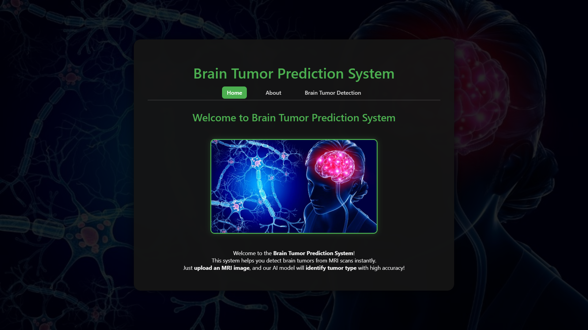
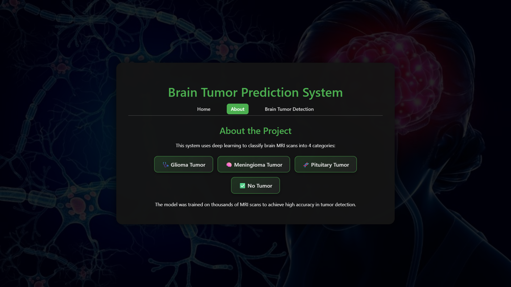
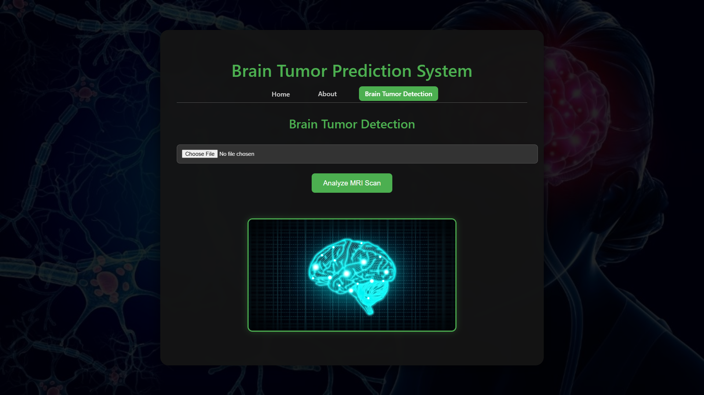
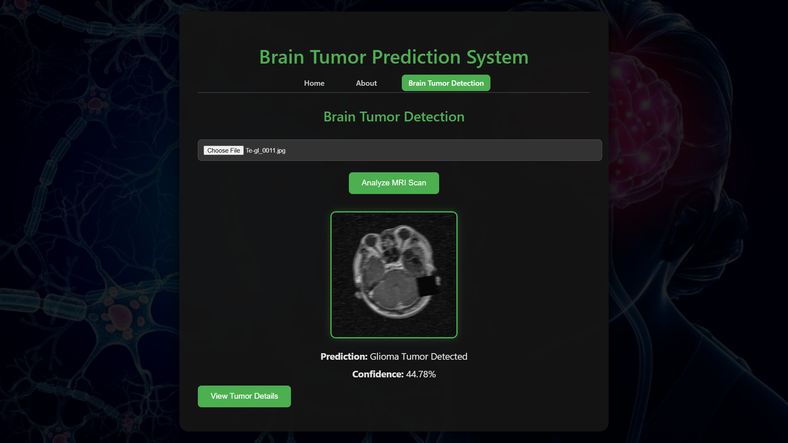
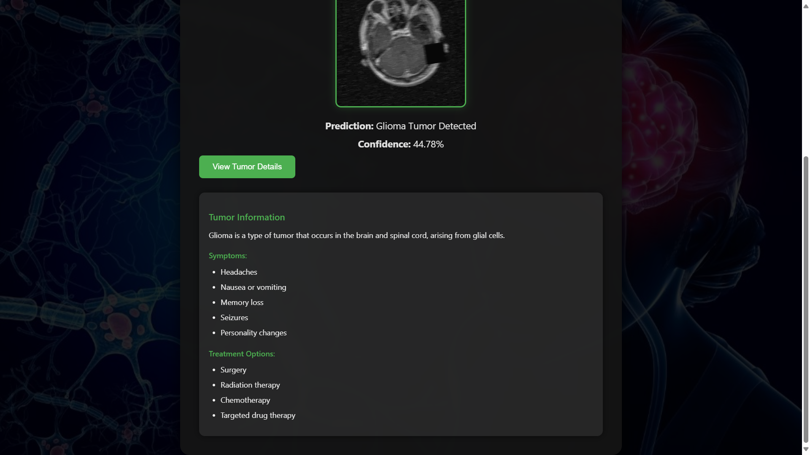

# 🧠 Brain Tumor MRI Analysis System  
> 🚀 **Finalist at Neural Nexus AI Challenge 2025**  

--- 

<p align="center">
  
  
  
  
  
  
  
</p>


## 📌 Overview  

Welcome to the **Brain Tumor MRI Analysis System** — a deep learning-powered web application that detects brain tumors from MRI scans and classifies them into **four categories**:

- 🩺 **Glioma Tumor**
- 🧠 **Meningioma Tumor**
- 🧬 **Pituitary Tumor**
- ✅ **No Tumor**

This AI model was trained on thousands of annotated MRI images to deliver **accurate, reliable, and real-time tumor classification** via a simple web interface.

---

## 🎉 Highlights  

✨ Deep Learning powered CNN model (Keras + TensorFlow)  
✨ Image preprocessing with OpenCV for optimized accuracy  
✨ Clean, modern, responsive Flask UI  
✨ Detailed tumor descriptions, symptoms, and treatments for each prediction  
✨ Finalist project at **Neural Nexus AI Model Challenge 2024**

---

## 📂 Project Structure  
```bash
Brain-Tumor-Analysis/
│
├── 📁 model/                 # Trained Keras model (.keras file)
├── 📁 static/                # Stylesheets, JS, preview images
├── 📁 templates/             # Flask HTML templates
├── 📁 uploads/               # Uploaded MRI images (auto-created at runtime)
│
├── 📄 app.py                 # Main Flask application
├── 📄 final_Model.ipynb      # Model training & export notebook
├── 📄 requirements.txt       # Python dependencies
├── 📄 README.md              # Project documentation
```

---

## 📸 Screenshots  

### 📌 Landing Page  


### 📌 About Section  


### 📌 Prediction Section  
**Upload Screen:**  
  
<br>
**Prediction Output:**  
  
<br>
**Detailed Tumor Info:**  


---

## ⚙️ How to Run  

### 📌 Clone the Repository  

```bash
git clone https://github.com/yourusername/brain-tumor-analysis.git
cd brain-tumor-analysis
```

---

## 📌 Set up Virtual Environment (recommended)
```bash
python -m venv venv
source venv/bin/activate  # or venv\Scripts\activate (Windows)
```

---

## 📌 Install Dependencies
``` bash
pip install -r requirements.txt
```
---

## 📌 Run the Flask Application
``` bash
python app.py
```
```bash
Then, open your browser and visit 👉 http://127.0.0.1:5000/
```
---

## 📖 Tech Stack
-🐍 Python 3.x
- 📦 Flask
- 📊 TensorFlow / Keras
- 📷 OpenCV
- 🖥️ HTML / CSS / JS

---

##  🏆 Challenge Achievement
### 🎖️ Finalist at Neural Nexus AI Model Challenge 2024

- Category: AI Medical Imaging
- Task: Brain Tumor MRI Classification

---

## 🙌 Acknowledgements
Huge thanks to the Neural Nexus community, mentors, and all the brilliant participants.
Inspired by the open-source AI for healthcare initiative.

--- 

## 🚀 Connect
Project by: TechTitans Team

<br>
